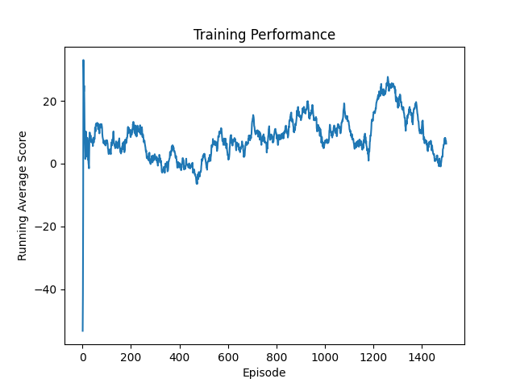

# CARLA SAC Driving

Reinforcement learning agent for autonomous driving in the [CARLA simulator](https://carla.org/), trained with **Soft Actor-Critic (SAC)** using PyTorch.

**Trained model:** [dia-agrawal/carla-sac-driving on Hugging Face](https://huggingface.co/dia-agrawal/carla-sac-driving)

Note: Claude isn't used in contribution to the code but chatgpt was used time to time to debug my code. I tested claude for the first time and had it push my code for me. 

## Overview

This project implements a custom [Gymnasium](https://gymnasium.farama.org/) environment wrapping CARLA 0.9.16, paired with a SAC agent that learns to follow a planned route while avoiding collisions.

Key components:

- **`CarlaDrivingEnv.py`** — Gymnasium-compatible CARLA environment with GPS/IMU sensors, Kalman-filtered pose estimation, A\*-based global route planning, and a shaped reward function.
- **`SAC/`** — SAC implementation in PyTorch (actor, twin critics, automatic entropy tuning, replay buffer).
- **`kalman_filter.py`** — 2-D Kalman filter fusing GPS and IMU measurements for smooth pose estimates.
- **`A_star.py`** — A\* path planner for waypoint generation on the CARLA map.

## Requirements

- CARLA 0.9.16 (download separately and place at `CARLA_0.9.16/`)
- Python 3.10+
- PyTorch
- Gymnasium
- NumPy, Matplotlib

Install Python dependencies:

```bash
pip install torch gymnasium numpy matplotlib
```

## Usage

Start the CARLA server first:

```bash
./CARLA_0.9.16/CarlaUE4.sh
```

Then run training:

```bash
cd SAC
python main_sac.py --run-name my_run --start-steps 2000
```

### CLI arguments

| Flag | Default | Description |
|---|---|---|
| `--run-name` | auto timestamp | Name for this run; checkpoints saved to `tmp/sac/<run-name>/` |
| `--chkpt-dir` | — | Override checkpoint directory |
| `--load-run` | — | Resume from a previous run directory |
| `--load-checkpoint` | false | Load models from the current checkpoint dir |
| `--reward-scale` | 1.0 | Reward scaling factor |
| `--start-steps` | 2000 | Random exploration steps before policy updates |
| `--render` | false | Enable CARLA spectator camera |

### Resume training

```bash
python main_sac.py --run-name my_run --load-checkpoint
```

## Reward Structure

The shaped reward combines several terms:

| Component | Description |
|---|---|
| Progress | Reward proportional to forward movement along the route |
| Alignment | Bonus for matching heading to the route direction |
| Speed | Small bonus for maintaining speed |
| Waypoint bonus | Reward on reaching each waypoint |
| Goal bonus | Large reward on reaching the destination |
| Collision penalty | Large negative reward on collision |
| Standstill penalty | Penalty for staying still |
| Steer smoothness | Penalty for large steering changes |

## Training Results

Learning curves are saved to `plots/` after each run.


